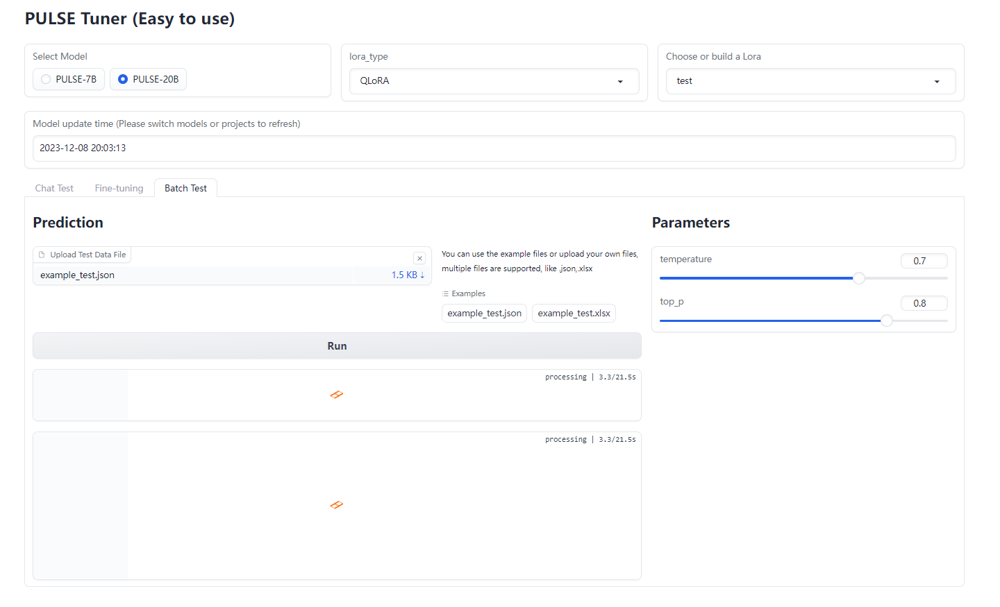

# pulse-tuner


[[English Version](https://github.com/JuneYaooo/pulse-tuner/blob/main/README.md)]   [[Chinese Version](https://github.com/JuneYaooo/pulse-tuner/blob/main/README_zh.md)]

With only twenty pieces of data, you can train your own robot in one and a half minutes! You can try this LLM Tuner suitable for PULSE.

## Usage

### Download Model and Modify Configuration File

If there are any issues with direct usage, you can download the PULSE model to your local machine from: [https://huggingface.co/OpenMEDLab/PULSE-7bv5](https://huggingface.co/OpenMEDLab/PULSE-7bv5)

Then, modify the model path in the `configs/common_config.py` file to the local path. You can modify the paths in the `model_path` variable.

### Installation

First, clone this project to your local machine:

```
git clone https://github.com/JuneYaooo/pulse-tuner.git
```

#### Install using pip

Create conda env:

- conda create -n pulse_tuner python=3.9

Navigate to the project directory and install the necessary dependencies:

```
cd pulse-tuner
conda activate pulse_tuner
pip install -r requirements.txt
```

#### Install using conda

Make sure the following dependencies are installed on your machine:

- Anaconda or Miniconda

Navigate to the project directory and create a new conda environment:

```
cd pulse-tuner
conda env create -f environment.yml
```

Activate the newly created environment:

```
conda activate pulse_tuner
```

Then run the web ui:

```
python app.py
```

### Instructions for Use

#### Try to chat with the lora

- Optional whether to add system commands;
- Currently supports multiple rounds of dialogue
- Streaming conversations to be supported
- The parameters `temperature` and `top_p` are used to adjust the diversity of model output. The larger the value, the greater the difference in each output. When it is 0, the output can be fixed.


#### Fine-Tune the Model using Lora

- PULSE-20B Fine-tuning currently requires a minimum of 24GB GPU (~one 3090), using 4bit Qlora by default, which takes up less space while maintaining good results.
- Supports multi-file training, such as excel and json files. The files must have a field named `input` and `output`. And `instruction` and `history` are optional.


#### Batch testing

- Batch testing supports multiple files, such as excel and json files. The files must have a field named `input` . And `instruction` and `history` are optional.




## Lora Example
You can use these parameters to reproduce test lora: `lora_type` = 'QLoRA', `per_device_train_batch_size`=4,`num_train_epochs`=15,`learning_rate`=0.001, using 'example_train.xlsx'


only takes 1.5 minutes, can reach the following effects:


## Acknowledgments

- [PULSE](https://github.com/openmedlab/PULSE): The model used in this project is based on PULSE.
- [llmtuner](https://github.com/hiyouga/LLaMA-Factory): The training and prediction code for this project is based on llmtuner and adapted to pulse.