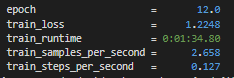
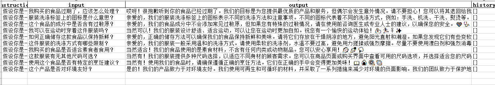

# pulse-tuner

[[中文](https://github.com/JuneYaooo/pulse-tuner/blob/main/README.md)]   [[英文](https://github.com/JuneYaooo/pulse-tuner/blob/main/README_zh.md)]

只需20条数据，就可以在两分钟内训练出属于自己的大模型！

## 使用方法

### 下载模型并修改配置文件

先从以下链接将PULSE模型下载到本地：[https://huggingface.co/OpenMEDLab/PULSE-7bv5](https://huggingface.co/OpenMEDLab/PULSE-7bv5)

然后，在 `configs/common_config.py` 文件中修改模型路径为本地路径。可以在 `model_path` 变量中修改路径。

### 安装

首先，将此项目克隆到本地：

```
git clone https://github.com/JuneYaooo/pulse-tuner.git
```

#### 使用pip安装

创建一个conda环境：

- conda create -n pulse_tuner python=3.9

安装必要的依赖项：

```
cd pulse-tuner
conda activate pulse_tuner
pip install -r requirements.txt
```

#### 使用conda安装

确保电脑安装了以下依赖项：

- Anaconda或Miniconda

创建一个新的conda环境：

```
cd pulse-tuner
conda env create -f environment.yml
```

激活新创建的环境：

```
conda activate pulse_tuner
```

然后运行Web界面：

```
python app.py
```

### 使用说明

#### 尝试与Lora聊天

- 是可选是否添加系统指令；
- 当前支持多轮对话
- 流式对话待支持
- 参数 `temperature` 和 `top_p` 用于调整模型输出的多样性。数值越大，每个输出之间的差异越大。当为0时，可以固定输出。


#### 使用Lora微调模型

- PULSE-20B微调 需要至少24GB GPU（约一个3090），默认使用4bit Qlora，保持良好效果的同时占用更小空间。
- 支持多文件训练，例如Excel和JSON文件。文件必须有一个名为 `input` 和 `output` 的字段。 `instruction` 和 `history` 是可选的。


#### 批量测试

- 批量测试支持多个文件，例如Excel和JSON文件。文件必须有一个名为 `input` 的字段。 `instruction` 和 `history` 是可选的。


## Lora示例
可以使用这些参数来复现测试Lora：`lora_type` = 'QLoRA'，`per_device_train_batch_size`=4，`num_train_epochs`=15，`learning_rate`=0.001，使用 'example_train.xlsx'


仅需1.5分钟，即可达到以下效果：




## 致谢

- [PULSE](https://github.com/openmedlab/PULSE)：本项目使用的模型基于PULSE。
- [llmtuner](https://github.com/hiyouga/LLaMA-Factory)：本项目的训练和预测代码基于llmtuner，并适配了pulse。